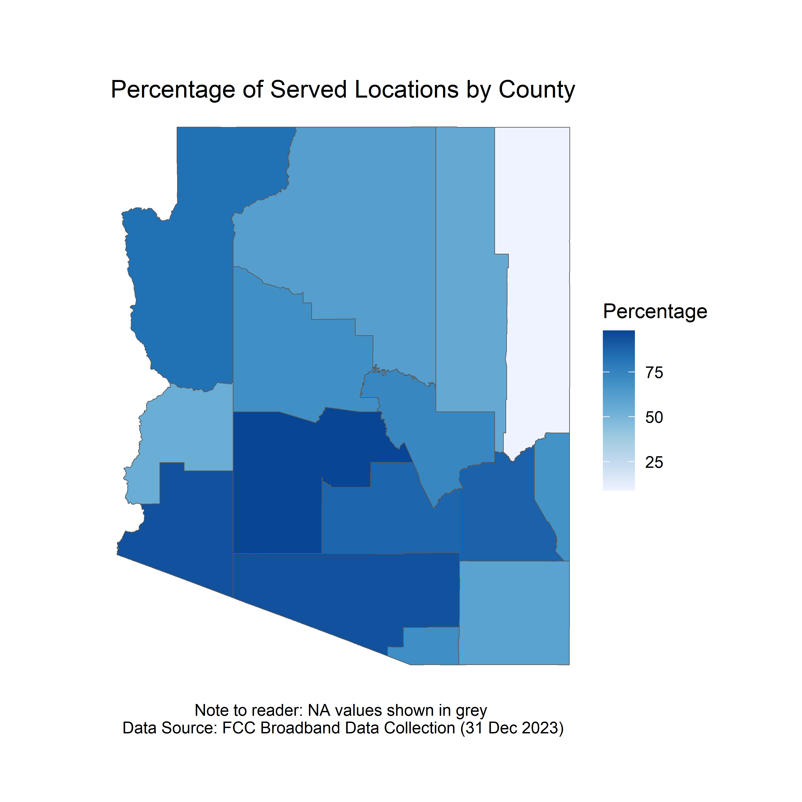
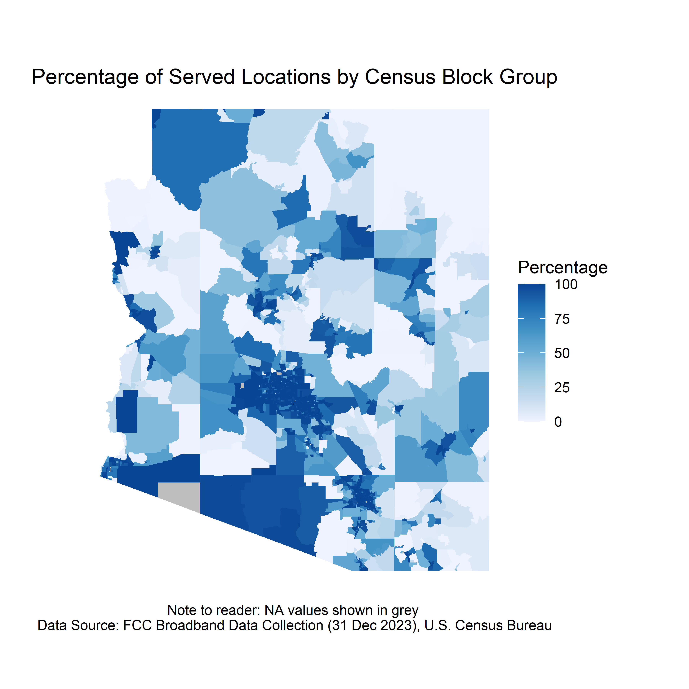

## WORKING WITH FCC BROADBAND AVAILABILITY DATA IN ARIZONA USING R. 

The following code uses FCC broadband availability data to determine the status (i.e., unserved, underserved, served) of broadband servicable locations (BSL). 
Arizona is the primary state of analysis, however, this code can be used for any state with Census and BDC data! Sections of the code where these changes can be made have been annotated.

The [_dyplr_](https://dplyr.tidyverse.org/) and [_tidyr_](https://tidyr.tidyverse.org/) packages are used to summarize the total number of unserved, underserved, and served locations within a particular geometry. The FCC Broadband Availability data is publicly available and can be downloaded at [_broadbandmap.fcc.gov_](https://broadband.fcc.gov). The dataset does not contain latitude/longitude information and cannot be mapped at the household level without a [CostQuest](https://www.costquest.com/resources/articles/broadband-policy/fcc-fabric-license-available-for-academic-broadband-research/) license. Instead, this analysis uses the H3 Hexagonal Grid and Census Block information included in the publicly available data. The [_tigris_](https://github.com/walkerke/tigris) package is used to directly download and use U.S. Census Bureau [TIGER/Line](https://www.census.gov/geographies/mapping-files/time-series/geo/tiger-line-file.html) spatial features (i.e., blocks, block groups, and counties). The [_h3jsr_](https://obrl-soil.github.io/h3jsr/) package is used to create [H3](https://h3geo.org/docs/core-library/overview/) Hexagonal Grids covering the entire state of Arizona. 

The [_ggplot2_](https://ggplot2.tidyverse.org/) package is used to map the percentage of served locations within a particular Census or H3 geometry. 

   

<sub>Download R Code here [broadband_availability_data_in_R.R](https://github.com/ksaves/krystalsaverse.github.io/blob/master/broadband_availability_data_in_R.R)</sub>
<br>

<details open>
<summary><h4>This analysis is broken into the following sections:</h4></summary>
  <ul><li>1. Import the FCC Broadband Availability Data</li>
  <li>2. Combine FCC Technology Files</li>
  <li>3. Explore Dataset</li>
  <li>4. Determine Location Status (i.e., unserved, underserved, served)</li>
  <li>5. Count Locations and Status per Census Geometry</li>
  <li>6. Optional: Export Table Data</li>
  <li>7. Create Choropleth Maps Using _ggplot2_</li>
  <li>8. Count Locations and Status per H3 Hexagonal Grid</li>
  <li>9. Create Choropleth Maps of H3 Status Using _ggplot2_</li>
  <li>10. Map the Percentage of Served Locations per H3 for all Counties</li></ul>
</details>
<br>

---

#### 1. Import the FCC Broadband Availability Data

First, download and save the broadband availaility data from the FCC National Broadband Map.
  * Go to the [FCC National Broadband Map](https://broadbandmap.fcc.gov/data-download)
  * In the FCC portal, select State, and download all fixed technologies
  * Unzip files


```r
# INSTALL PACKAGES
install.packages("dplyr", "tidyr", "readr")

# LOAD PACKAGES
library(dplyr)
library(tidyr)
library(readr)

# VIEW PACKAGE HELP
?readr
?dplyr
?tidyr

# PRINT CURRENT WORKING DIRECTORY
getwd()

# UPDATE WORKING DIRECTORY TO FOLDER LOCATION WHERE FCC CSV FILES ARE SAVED
setwd("C:/") # CODE: INSERT FILE PATH IN PARENTHESES

# OPTIONAL: # MANUALLY SET WORKING DIRECTORY
# STEPS: IN R, GO TO: SESSION > SET WORKING DIRECTORY > CHOOSE DIRECTORY > SELECT LOCATION WHERE FCC FILES ARE SAVED 

# IMPORT FCC CSV FILES
cable <- read_csv("bdc_04_Cable_fixed_broadband_D23_14may2024.csv")
copper <- read_csv("bdc_04_Copper_fixed_broadband_D23_14may2024.csv")
fiber <- read_csv("bdc_04_FibertothePremises_fixed_broadband_D23_14may2024.csv")
GSO_sat <- read_csv("bdc_04_GSOSatellite_fixed_broadband_D23_14may2024.csv")
LBR_FW <- read_csv("bdc_04_LBRFixedWireless_fixed_broadband_D23_14may2024.csv")
L_FW <- read_csv("bdc_04_LicensedFixedWireless_fixed_broadband_D23_14may2024.csv")
NGSO_sat <- read_csv("bdc_04_NGSOSatellite_fixed_broadband_D23_14may2024.csv")
other <- read_csv("bdc_04_Other_fixed_broadband_D23_14may2024.csv")
Un_FW <- read_csv("bdc_04_UnlicensedFixedWireless_fixed_broadband_D23_14may2024.csv")
```
<br>

---

#### 2. Combine FCC Technology Files

```r
# BIND ALL ROWS
fcc <- bind_rows(cable, copper, fiber, GSO_sat, LBR_FW, 
                 L_FW, NGSO_sat, other, Un_FW)

# OPTIONAL: CLEAN UP ENVIRONMENT
rm(cable, copper, fiber, GSO_sat, LBR_FW, 
   L_FW, NGSO_sat, other, Un_FW)
```
<br>

---

#### 3. Explore Dataset

Note: Data Specs found here: https://us-fcc.box.com/v/bdc-data-downloads-output

```r
# VIEW THE DATA OR VIEW THE TRANSPOSED DATA
fcc
glimpse(fcc)

# VIEW COLUMN HEADERS (I.E., NAMES)
names(fcc)

# RETURNS THE NUMBER OF UNIQUE LOCATION IDS
length(unique(fcc$location_id))

# RETURNS ALL UNIQUE ELEMENTS IN A COLUMN
unique(fcc$business_residential_code)
```
<br>

---

#### 4. Determine Location Status (i.e., unserved, underserved, served)

```r
# DETERMINE LOCATION STATUS
fcc_bsl_status <- fcc %>%
  mutate(num_status = if_else(low_latency == 0 | 
                            max_advertised_download_speed < 25 | 
                            max_advertised_upload_speed < 3 |
                            technology %in% c(0, 60, 61, 70), 0, # UNSERVED
                          if_else(low_latency == 1 & 
                                    (between(max_advertised_download_speed, 25, 99) | 
                                    between(max_advertised_upload_speed, 3, 19)) &
                                    technology %in% c(10, 40, 50, 71, 72), 1, # UNDERSERVED
                          if_else(low_latency == 1 & 
                                    max_advertised_download_speed >= 100 & 
                                    max_advertised_upload_speed >= 20 &
                                    technology %in% c(10, 40, 50, 71, 72), 2, NA)))) %>% # SERVED
  group_by(location_id, block_geoid, h3_res8_id) %>%
  summarise(status = as.character(max(num_status))) %>%
  ungroup() %>%
  mutate(status = if_else(status == 0, "unserved", 
                          if_else(status == 1, "underserved",
                                  if_else(status == 2, "served", NA))))

# COUNT TOTAL LOCATIONS AND STATUS
fcc_bsl_status %>%
  group_by(status) %>%
  summarise(count = n()) 
```
<br>

---

#### 5. Count Locations and Status per Census Geometry 

```r
# USE TIGER/LINE DATA FROM US CENSUS BUREAU IN R USING 'TIGRIS'

# INSTALL PACKAGE
install.packages("tigris")

# LOAD PACKAGE
library(tigris)

# VIEW PACKAGE HELP
?tigris

# NOTE: DEFAULT CRS FOR ALL TIGRIS GEOMETRIES IS NAD 1983 (EPSG: 4269)

# DOWNLOAD TIGER/LINE GEOMETRIES (COUNTIES, BLOCK GROUPS, BLOCKS)
counties <- counties(state = "AZ", # USE TWO-DIGIT FIPS CODE OR TWO-CHAR STRING FOR STATE
                           cb = FALSE, 
                           year = 2023)

block_groups <- block_groups(state = "AZ", # USE TWO-DIGIT FIPS CODE OR TWO-CHAR STRING FOR STATE
                             county = counties$COUNTYFP,
                             cb = FALSE,
                             year = 2023)

blocks <- blocks(state = "AZ", # USE TWO-DIGIT FIPS CODE OR TWO-CHAR STRING FOR STATE
                 county = counties$COUNTYFP,
                 year = 2023)

# VERIFY CLASS OF R OBJECTS
class(counties)
```
```r
# COUNT LOCATION AND STATUS PER COUNTY
counties_summary <- fcc_bsl_status %>%
  mutate(geoid = substr(block_geoid, start = 1, stop = 5)) %>%
  left_join(counties, join_by(geoid == GEOID)) %>% 
  group_by(NAME, status) %>% 
  summarise(count = n()) %>%
  pivot_wider(names_from = status, names_prefix = "count_", values_from = count, values_fill = 0) %>%
  mutate(perc_unserved = round(count_unserved/(count_unserved + count_underserved + count_served) *100),
         perc_underserved = round(count_underserved/(count_unserved + count_underserved + count_served) *100),
         perc_not_served = round((count_unserved + count_underserved) / (count_unserved + count_underserved + count_served) *100),
         perc_served = round(count_served/(count_unserved + count_underserved + count_served) *100)) 

# COUNT LOCATION AND STATUS PER BLOCK GROUP
block_groups_summary <- fcc_bsl_status %>%
  mutate(geoid = substr(block_geoid, start = 1, stop = 12)) %>%
  left_join(block_groups, join_by(geoid == GEOID)) %>% 
  group_by(geoid, status) %>% 
  summarise(count = n()) %>%
  pivot_wider(names_from = status, names_prefix = "count_", values_from = count, values_fill = 0) %>%
  mutate(perc_unserved = round(count_unserved/(count_unserved + count_underserved + count_served) *100),
         perc_underserved = round(count_underserved/(count_unserved + count_underserved + count_served) *100),
         perc_not_served = round((count_unserved + count_underserved) / (count_unserved + count_underserved + count_served) *100),
         perc_served = round(count_served/(count_unserved + count_underserved + count_served) *100))

# COUNT LOCATION AND STATUS PER BLOCK
blocks_summary <- fcc_bsl_status %>%
  left_join(blocks, join_by(block_geoid == GEOID20), multiple = "all") %>%
  group_by(block_geoid, status) %>% 
  summarise(count = n()) %>%
  pivot_wider(names_from = status, names_prefix = "count_", values_from = count, values_fill = 0) %>%
  mutate(perc_unserved = round(count_unserved/(count_unserved + count_underserved + count_served) *100),
         perc_underserved = round(count_underserved/(count_unserved + count_underserved + count_served) *100),
         perc_not_served = round((count_unserved + count_underserved) / (count_unserved + count_underserved + count_served) *100),
         perc_served = round(count_served/(count_unserved + count_underserved + count_served) *100))

# VERIFY CLASS OF R OBJECTS
class(counties_summary)
```
<br>

---

#### 6. Optional: Export Table Data
```r
# GET THE WORKING DIRECTORY
getwd() # THIS IS THE LOCATION FILES WILL BE SAVED

# EXPORT TABLES TO CSV
write_csv(fcc, "bdc_fixed_broadband_Dec23_updated14may2024_out05302024.csv")
write_csv(fcc_bsl_status, "bsl_status_from_bdc_fixed_broadband_Dec23_updated14may2024_out05302024.csv")
write_csv(counties_summary, "county_summary_from_bdc_fixed_broadband_Dec23_updated14may2024_out05302024.csv")
write_csv(block_groups_summary, "block_group_summary_bdc_fixed_broadband_Dec23_updated14may2024_out05302024.csv")
write_csv(blocks_summary, "block_summary_from_bdc_fixed_broadband_Dec23_updated14may2024_out05302024.csv")
```
<br>

---

#### 7. Create Choropleth Maps Using _ggplot2_
```r
# INSTALL GGPLOT2 PACKAGE
install.packages("ggplot2")

# LOAD PACKAGE
library(ggplot2)

# VIEW PACKAGE HELP
?ggplot2
```
```r
# MAP PERCENTAGE OF SERVED LOCATIONS BY COUNTY
left_join(counties, counties_summary, join_by(NAME)) %>% 
  ggplot() +
  geom_sf(mapping = aes(geometry = geometry, fill = perc_served)) +
  scale_fill_distiller(type = "seq",
                       palette = "Blues",
                       direction = 1,
                       na.value = "grey") + 
  labs(title = "Percentage of Served Locations by County",
       caption = "Note to reader: NA values shown in grey \nData Source: FCC Broadband Data Collection (31 Dec 2023)",
       fill = "Percentage") + 
  theme_void() + 
  theme(plot.background = element_rect(fill = "white", color = NA),
        plot.margin = margin(0.5, 0.5, 0.5, 0.5, "in"),
        plot.title = element_text(hjust = 0.5, vjust = 0.5),
        plot.caption = element_text(hjust = 0.5, vjust = 0.5))

# OPTIONAL: SAVE MAP AS PNG
ggsave("Map_of_Percentage_of_Served_Locations_by_County.png",
       plot = last_plot(),
       width = 6,
       height = 6,
       units = "in",
       dpi = 600)
```


```r
# MAP PERCENTAGE OF SERVED LOCATIONS BY BLOCK GROUP
left_join(block_groups, block_groups_summary, join_by(GEOID == geoid)) %>% 
  ggplot() +
  geom_sf(mapping = aes(geometry = geometry, fill = perc_served), color = NA) +
  #geom_sf(data = counties, mapping = aes(geometry = geometry), fill = NA, linewidth = 0.5) + # OPTIONAL: ADD COUNTY BOUNDARIES
  scale_fill_distiller(type = "seq",
                       palette = "Blues",
                       direction = 1,
                       na.value = "grey") + 
  labs(title = "Percentage of Served Locations by Census Block Group",
       caption = "Note to reader: NA values shown in grey \nData Source: FCC Broadband Data Collection (31 Dec 2023), U.S. Census Bureau",
       fill = "Percentage") + 
  theme_void() + 
  theme(plot.background = element_rect(fill = "white", color = NA),
        plot.margin = margin(0.5, 0.5, 0.5, 0.5, "in"),
        plot.title = element_text(hjust = 0.5, vjust = 0.5),
        plot.caption = element_text(hjust = 0.5, vjust = 0.5))

# OPTIONAL: SAVE MAP AS PNG
ggsave("Map_of_Percentage_of_Served_Locations_by_BlockGroup.png",
       plot = last_plot(),
       width = 6,
       height = 6,
       units = "in",
       dpi = 600)
```


```r
# MAP PERCENTAGE OF SERVED LOCATIONS BY BLOCK
left_join(blocks, blocks_summary, join_by(GEOID20 == block_geoid)) %>% 
  ggplot() +
  geom_sf(mapping = aes(geometry = geometry, fill = perc_served), color = NA) +
  #geom_sf(data = counties, mapping = aes(geometry = geometry), fill = NA, linewidth = 0.5) + # OPTIONAL: ADD COUNTY BOUNDARIES
  scale_fill_distiller(type = "seq",
                       palette = "Blues",
                       direction = 1,
                       na.value = "grey") +
  labs(title = "Percentage of Served Locations by Census Block",
       caption = "Note to reader: NA values shown in grey \nData Source: FCC Broadband Data Collection (31 Dec 2023), U.S. Census Bureau",
       fill = "Percentage") + 
  theme_void() + 
  theme(plot.background = element_rect(fill = "white", color = NA),
        plot.margin = margin(0.5, 0.5, 0.5, 0.5, "in"),
        plot.title = element_text(hjust = 0.5, vjust = 0.5),
        plot.caption = element_text(hjust = 0.5, vjust = 0.5))

# OPTIONAL: SAVE MAP AS PNG
ggsave("Map_of_Percentage_of_Served_Locations_by_Block.png",
       plot = last_plot(),
       width = 6,
       height = 6,
       units = "in",
       dpi = 600)
```


<br>

---

#### 8. Count Locations and Status per H3 Hexagonal Grid
```r
# INSTALL PACKAGE
install.packages("h3jsr", "sf")

# LOAD PACKAGE
library(h3jsr)
library(sf)

# VIEW PACKAGE HELP
?h3jsr
?sf

# GET STATE GEOMETRY (DEFAULT CRS IS EPSG: 4269)
state <- states(year = 2023) %>%
  filter(NAME == "Arizona")

# GET LIST OF H3 CELLS IN STATE (DEFAULT CRS TAKEN FROM INPUT SF GEOMETRY)
h3_ids <- polygon_to_cells(geometry = state, res = 8, simple = FALSE) # CREATES A SINGLE POLYGON OF ALL CELLS

# CONVERT LIST OF CELLS TO POLYGONS (DEFAULT IS EPSG:4326)
h3 <- cell_to_polygon(unlist(h3_ids$h3_addresses), simple = FALSE) # CREATES MULTIPLE POLYGONS OF ALL CELLS

# CONVERT COORDINATE REFRENCE SYSTEM TO EPSG: 4269
h3 <- st_transform(h3, 4269)
st_crs(h3)

# COUNT LOCATIONS AND STATUS PER HEX BIN
h3_summary <- fcc_bsl_status %>%
  left_join(h3, join_by(h3_res8_id == h3_address), multiple = "all") %>%
  group_by(h3_res8_id, status) %>% 
  summarise(count = n()) %>%
  pivot_wider(names_from = status, names_prefix = "count_", values_from = count, values_fill = 0) %>%
  mutate(perc_unserved = round(count_unserved/(count_unserved + count_underserved + count_served) *100),
         perc_underserved = round(count_underserved/(count_unserved + count_underserved + count_served) *100),
         perc_not_served = round((count_unserved + count_underserved) / (count_unserved + count_underserved + count_served) *100),
         perc_served = round(count_served/(count_unserved + count_underserved + count_served) *100))

# OPTIONAL: EXPORT TABLE TO CSV
write_csv(h3_summary, "h3_summary_bdc_fixed_broadband_Dec23_updated14may2024_out05302024.csv")
```
<br>

---

#### 9. Create Choropleth Maps of H3 Status Using _ggplot2_
```r
# MAP PERCENTAGE OF SERVED LOCATIONS BY H3
left_join(h3, h3_summary, join_by(h3_address == h3_res8_id)) %>% 
  ggplot() +
  geom_sf(mapping = aes(geometry = geometry, fill = perc_served), color = NA) +
  #geom_sf(data = counties, mapping = aes(geometry = geometry), fill = NA, linewidth = 0.5) + # OPTIONAL: ADD COUNTY BOUNDARIES
  scale_fill_distiller(type = "seq",
                       palette = "Blues",
                       direction = 1,
                       na.value = "grey") + 
  labs(title = "Percentage of Served Locations by H3 Hexagonal Grid",
       caption = "Note to reader: NA values shown in grey \nData Source: FCC Broadband Data Collection (31 Dec 2023)",
       fill = "Percentage") + 
  theme_void() + 
  theme(plot.background = element_rect(fill = "white", color = NA),
        plot.margin = margin(0.5, 0.5, 0.5, 0.5, "in"),
        plot.title = element_text(hjust = 0.5, vjust = 0.5),
        plot.caption = element_text(hjust = 0.5, vjust = 0.5))

# OPTIONAL: SAVE MAP AS PNG
ggsave("Map_of_Percentage_of_Served_Locations_by_H3_Hexagonal_Grid.png",
       plot = last_plot(),
       width = 6,
       height = 6,
       units = "in",
       dpi = 600)
```


Note: Notice the output is difficult to interpret. Alternatively, we can map the percentage of served locations at the county level for easier viewing. 

```r
# FILTER COUNTY OF INTEREST
county_of_interest <- counties %>%
  filter(NAME == "Maricopa") # ENTER COUNTY NAME HERE

# GET LIST OF H3 CELLS IN STATE (DEFAULT IS EPSG:4326)
county_h3_ids <- polygon_to_cells(geometry = county_of_interest, res = 8, simple = FALSE)

# CONVERT LIST OF CELLS TO POLYGONS
county_h3 <- cell_to_polygon(unlist(county_h3_ids$h3_addresses), simple = FALSE)

# CONVERT COORDINATE REFRENCE SYSTEM TO EPSG: 4269
county_h3 <- st_transform(county_h3, 4269)

# COUNT LOCATIONS AND STATUS PER HEX BIN
left_join(county_h3, h3_summary, join_by(h3_address == h3_res8_id)) %>% 
  ggplot() + 
  geom_sf(mapping = aes(geometry = geometry, fill = perc_served), color = NA) +
  scale_fill_distiller(type = "seq",
                       palette = "Blues",
                       direction = 1,
                       na.value = "grey") + 
  labs(title = paste("Percentage of Served Locations by H3 Hexagonal Grid \n", county_of_interest$NAME, "County"),
       caption = "Note to reader: NA values shown in grey \nData Source: FCC Broadband Data Collection (Dec 2023)",
       fill = "Percentage") + 
  theme_void() + 
  theme(plot.background = element_rect(fill = "white", color = NA),
        plot.margin = margin(0.5, 0.5, 0.5, 0.5, "in"),
        plot.title = element_text(hjust = 0.5, vjust = 0.5),
        plot.caption = element_text(hjust = 0.5, vjust = 0.5))
```


Note: Manually creating a map for each county may be very time consuming. Instead, we can use a _for loop_ to create maps for each county. 
<br>

---

#### 10. Map the Percentage of Served Locations per H3 for all Counties
```r
# CREATE EMPTY VECTORS
county_of_interest <- 1
county_h3_ids <- 1
county_h3 <- 1

# FOR LOOP ITERATES FOR EACH COUNTY
for (i in 1:nrow(counties)) {
  county_of_interest <- counties[i,]
  county_h3_ids <- polygon_to_cells(geometry = county_of_interest, res = 8, simple = FALSE) 
  county_h3 <- cell_to_polygon(unlist(county_h3_ids$h3_addresses), simple = FALSE)
  county_h3 <- st_transform(county_h3, 4269)
  left_join(county_h3, h3_summary, join_by(h3_address == h3_res8_id)) %>%     
    ggplot() + 
    geom_sf(mapping = aes(geometry = geometry, fill = perc_served), color = NA) +
    scale_fill_distiller(type = "seq",
                         palette = "Blues",
                         direction = 1,
                         na.value = "grey") + 
    labs(title = paste("Percentage of Served Locations by H3 Hexagonal Grid \n", county_of_interest$NAME, "County"),
         caption = "Note to reader: NA values shown in grey \nData Source: FCC Broadband Data Collection (31 Dec 2023)",
         fill = "Percentage") + 
    theme_void() + 
    theme(plot.background = element_rect(fill = "white", color = NA),
          plot.margin = margin(0.5, 0.5, 0.5, 0.5, "in"),
          plot.title = element_text(hjust = 0.5, vjust = 0.5),
          plot.caption = element_text(hjust = 0.5, vjust = 0.5))
  ggsave(paste("Map_of_Percentage_of_Served_Locations_by_H3_Hexagonal_Grid_", county_of_interest$NAME, "_County.png", sep = ""),
         plot = last_plot(),
         width = 6,
         height = 6,
         units = "in",
         dpi = 600)
}

# CHECK WORKING DIRECTORY FOLDER FOR SAVED COUNTY PLOTS
getwd()
```

