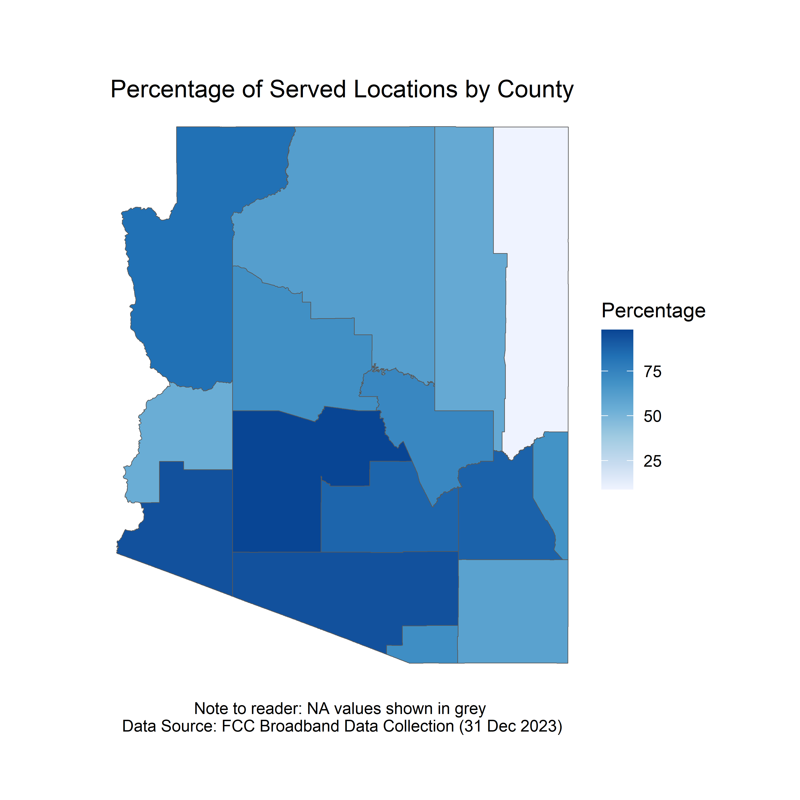
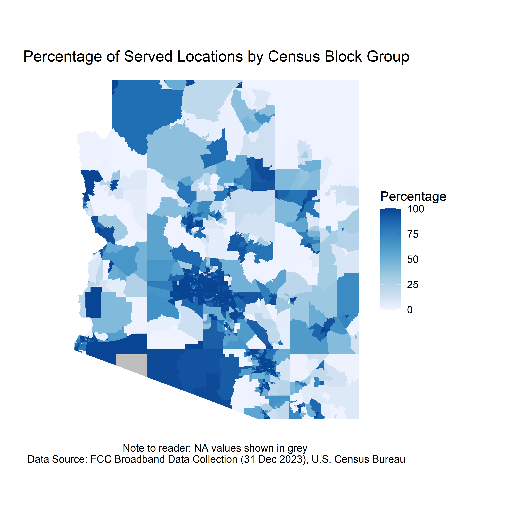
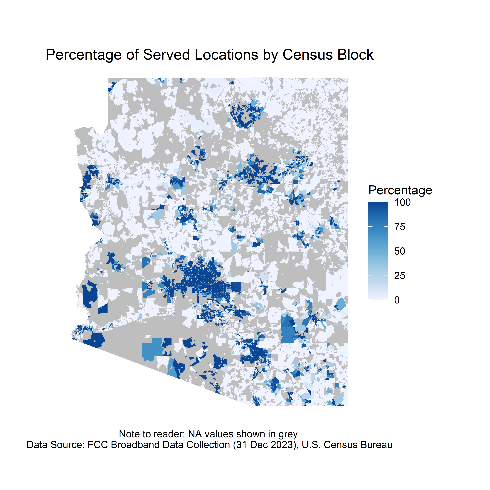
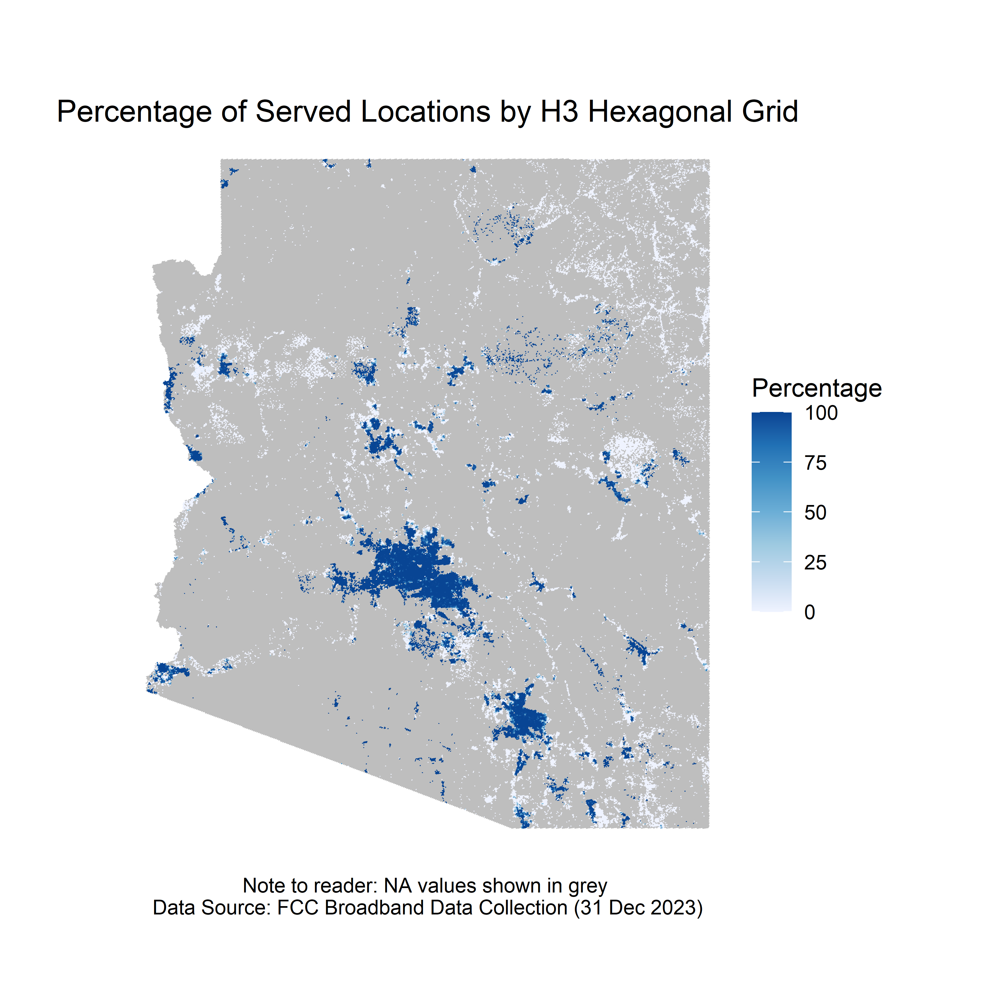

# GIS Portfolio

---

## Working with FCC Broadband Availability Data in Arizona Using R

The following code uses FCC Broadband Availability Data to determine the status (i.e., unserved, underserved, served) of broadband servicable locations (BSL). Arizona is the primary state for this analysis, however, this code can be used for any state!

The [_dyplr_](https://dplyr.tidyverse.org/) and [_tidyr_](https://tidyr.tidyverse.org/) packages are used to summarize the total number of unserved, underserved, and served locations within a particular geometry. The FCC Broadband Availability data is publicly available and can be downloaded here [broadbandmap.fcc.gov](https://broadband.fcc.gov). The dataset does not contain latitude/longitude information and cannot be mapped at the household level without a [CostQuest](https://www.costquest.com/resources/articles/broadband-policy/fcc-fabric-license-available-for-academic-broadband-research/) license. Instead, this analysis uses the H3 Hexagonal Grid and Census Block information included in the publicly available data. The [_tigris_](https://github.com/walkerke/tigris) package is used to directly download and use [U.S. Census Bureau TIGER/Line](https://www.census.gov/geographies/mapping-files/time-series/geo/tiger-line-file.html) spatial features (i.e., blocks, block groups, and counties). The [_h3jsr_](https://obrl-soil.github.io/h3jsr/) package is used to create [H3 Hexagonal Grids](https://h3geo.org/docs/core-library/overview/) covering the entire state of Arizona. The [_ggplot2_](https://ggplot2.tidyverse.org/) package is used to map the percentage of served locations within a particular Census or H3 geometry. 

   

<sub>Download R Code here [broadband_availability_data_in_R.pdf](https://github.com/ksaves/krystalsaverse.github.io/blob/master/pdf/broadband_availability_data_in_R.pdf)</sub>


```r
# IMPORT FCC CSV FILES
cable <- read_csv("bdc_04_Cable_fixed_broadband_D23_14may2024.csv")
# BIND ALL ROWS
fcc <- bind_rows(cable, copper, fiber, GSO_sat, LBR_FW, L_FW, NGSO_sat, other, Un_FW)
```

<details>
    <summary>There's code inside this dropdown...</summary>
    <br>
    
    ```javascript
    console.log("Hello, world!");
    ```
</details>

---

<p style="font-size:11px">Page template forked from <a href="https://github.com/evanca/quick-portfolio">evanca</a></p>
<!-- Remove above link if you don't want to attibute -->
